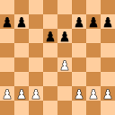
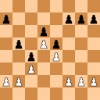

From Rio's **Chess Structures, A Grandmaster's Guide**

| Structure                                                    | White plans                                                  | Black plans |
| ------------------------------------------------------------ | ------------------------------------------------------------ | ----------- |
| **IQP**                  | isolani or IQP from the "d4 and ...d5" family                |             |
| **hanging pawns**        | hanging pawns from the "d4 and ...d5" family                 |             |
| **Caro-Kann**            | Caro-Kann formation from the "d4 and ...d5" family           |             |
| **slav**                 | slav formation from the "d4 and ...d5" family                |             |
| **Carlsbad**             | Carlsbad formation from the "d4 and ...d5" family            |             |
| **stonewall**            | Stonewall from the "d4 and ...d5" family                     |             |
| **grunfeld**             | Grunfeld center from the "d4 and ...d5" family               |             |
| **Najdorf Type I**       | Najdorf Type I from the open sicilian                        |             |
| **Najdorf Type II**      | Najdorf Type II from the open sicilian                       |             |
| **hedgehog**             | hedgehog from the open sicilian                              |             |
| **Maroczy**             | The Maroczy from the open sicilian                           |             |
| **assymmetric Benoni**  | assymmetric Benoni from the Benoni family                    |             |
| **symmetric Benon**     | Symmetric Benoni from the Benoni family                      |             |
| **KID Type I**          | KID Type I from King's Indian family                         |             |
| **KID Type II**         | KID Type II from the King's Indian family                    |             |
| **KID Type III**        | KID Type III from the King's Indian family                   |             |
| **Open KID**            | Open KID from the King's Indian family                       |             |
| **KID Complex**         | KID Complex from the King's Indian family                    |             |
| **French type I**       | French type I from the French family                         |             |
| **French type II**      | French type II from the French family                        |             |
| **French type III**     | French type III from the French family * test Shit, no bulleted list? Ok |             |
| **3-3 vs. 4-2**         | The 3-3 vs. 4-2 Structure from the miscellaneous family      |             |
| **Panov structure**     | Panov structure from the miscellaneous family                |             |
| **Dragon formation**    | Dragon formation from the miscellaneous family               |             |
| **Scheveningen**        | Scheveningen from the miscellaneous family                   |             |
| **Benko**               | Benko structure from the misc. family                        |             |
| **Closed Ruy Lopez**    | Closed Ruy Lopez structure from the misc. family             |             |
| **Lopez**               | Lopez formation structure from the misc. family              |             |

1. d4...d5 family
   1. isolani or IQP
   2. hanging pawns
   3. Caro-Kann
   4. slav
   5. Carlsbad
   6. stonewall
   7. Grunfeld center
2. Open Sicilian
   1. Najdorf Type I
   2. Najdorf Type II
   3. hedgehog
   4. Marcy
3. Benoni
   1. assymmetric Benoni
   2. symmetric Benoni
4. King's Indian family
   1. KID Type I
   2. KID Type II
   3. KID Type III
   4. Open KID
   5. KID complex
5. French family
   1. French type I (black's f-pawn traded)
   2. French type II (advance variation, c pawn traded)
   3. French type III (advance variation, c pawn not traded)
6. Miscellaneous
   1. The 3-3 vs. 4-2
   2. Panov structure
   3. Dragon formation
   4. Scheveningen
   5. Benko
   6. Closed Ruy Lopez
   7. Lopez
